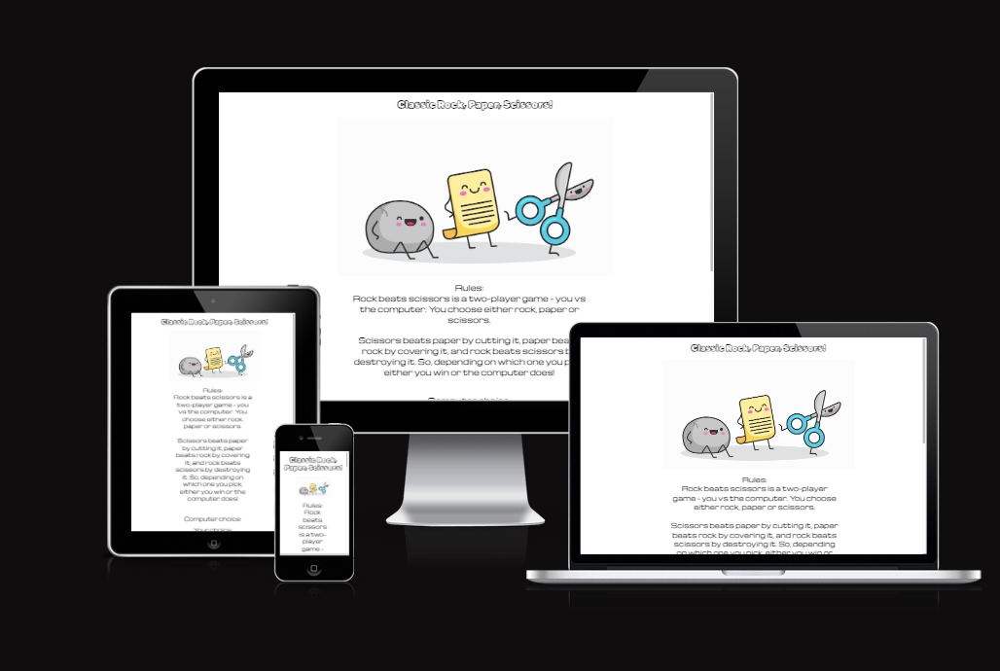
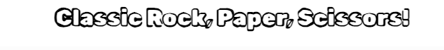
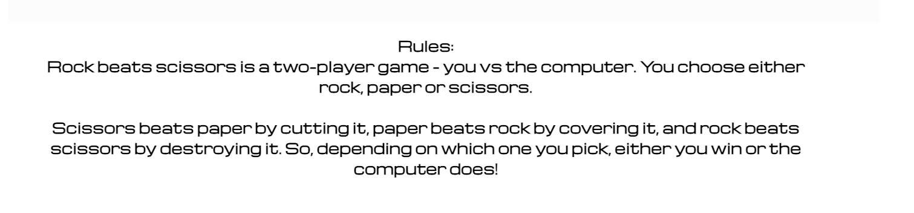
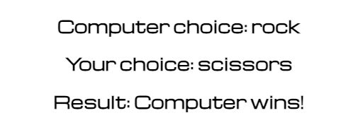
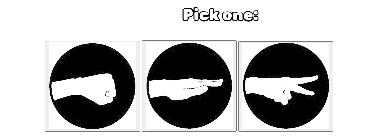
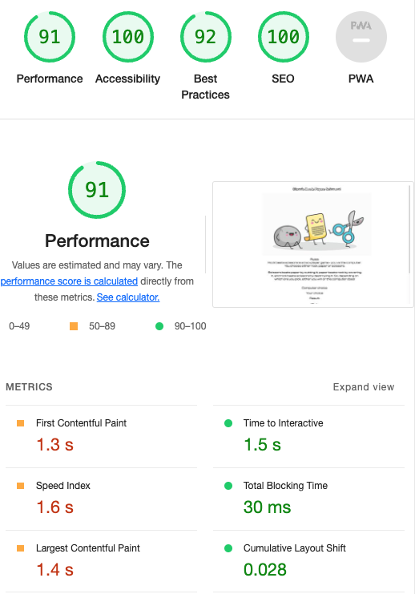
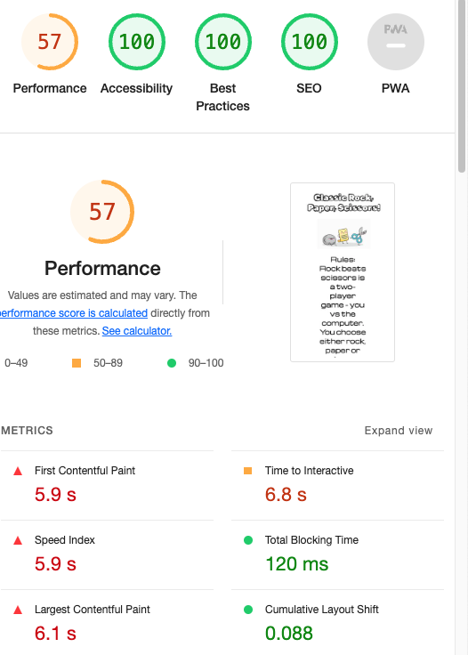
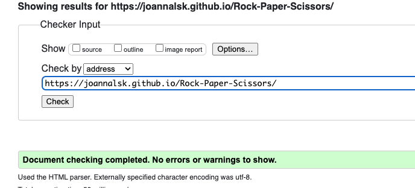
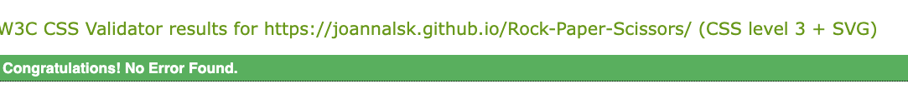

<h1>Classic Rock, Paper, Scissors!</h1>

Classic Rock, Paper, Scissors is a game of you vs the computer. It takes the much familiar and loved children's game and turns into a game with the computer instead. The difference is, there's no clues or cues, no smiles or sniggers - it's you vs the machine.

<h2>Features</h2>

<strong>Header</strong>

The header is right at the top and is the site's title. I used Google fonts to find a fun and quirky typeface to use. 

<strong>Main Image</strong>

To match the quirky typeface of the header, I wanted a fun and quirky image to represent the different options in the game. I liked the idea of the rock, paper and scissors being cartoon characters, so chose this as my main image to make visitors to my site interested in the game.

<strong>Rules</strong>

Even though most people are familiar with how to play rock, paper, scissors, I felt the rules of the game were needed to make it clear.The game is pretty simple - rock beats scissors, scissors beats paper, paper beats rock.

<h2>The Game</h2>

When the user clicks on one of the three images, their choice is displayed as 'Your Choice' with 'Computer Choice' underneath. The result is displayed at the bottom, either with 'Player wins', 'Computer wins' or 'Draw'. This way, the player can keep track of who is winning the game and keep score.

<strong>The buttons</strong>

I wanted the user to be able to click on an image, instead of a button with text, as I felt this was visually more appealing. Each of the images are clear to see and it's easy to pick which image represents rock, paper and scissors. I used the same font as the header above it, to invite the user to choose which button to press.

<h1>For the future</h1>

I would like to add a score tracking function, but unfortunately I was unable to make this work. Obviously this would be more ideal than the user keeping score on paper. I would also add pictures to represent the player and computer choice.

<h1>Testing</h1>

 I checked that the functions for player choice and computer choice and result were always correct. 

I ran the desktop version through Lighthouse and checked it reached the acceptable scores for accessibility, SEO, performance etc

I also ran the site throgh Lighthouse for the mobile version to make sure it worked as well on the small screen.

In future, I would like to improve the site's performance for mobile, but everything else is good.

<h1>Bugs</h1>

No known bugs were detected when I pushed it to Pages on Github.

<h1>Validator testing</h1>

HTML - It passed the W3C validator without errors

CSS - It passed the W3C validator without any errors.

Javascript - It passed through JShint with 38 warnings, but no errors.

<h1>Deployment</h1>

The site was deployed to Github Pages. Simply navigate to settings, then Pages to find the live link. The live link is here: https://joannalsk.github.io/Rock-Paper-Scissors/

<h1>Credits</h1>

The main image is from https://www.vecteezy.com/vector-art/693105-cartoon-rock-paper-scissors-vector-characters

The images for the rock, paper, scissors icons are from https://www.seekpng.com/idown/u2q8u2a9a9o0r5a9_rock-paper-scissors-rock-paper-scissors-png/

The tutorial https://www.youtube.com/watch?v=RwFeg0cEZvQ&t=1771s by for the Java inspiration.

Thanks to my mentor, Rahul and everyone on Slack as always!

